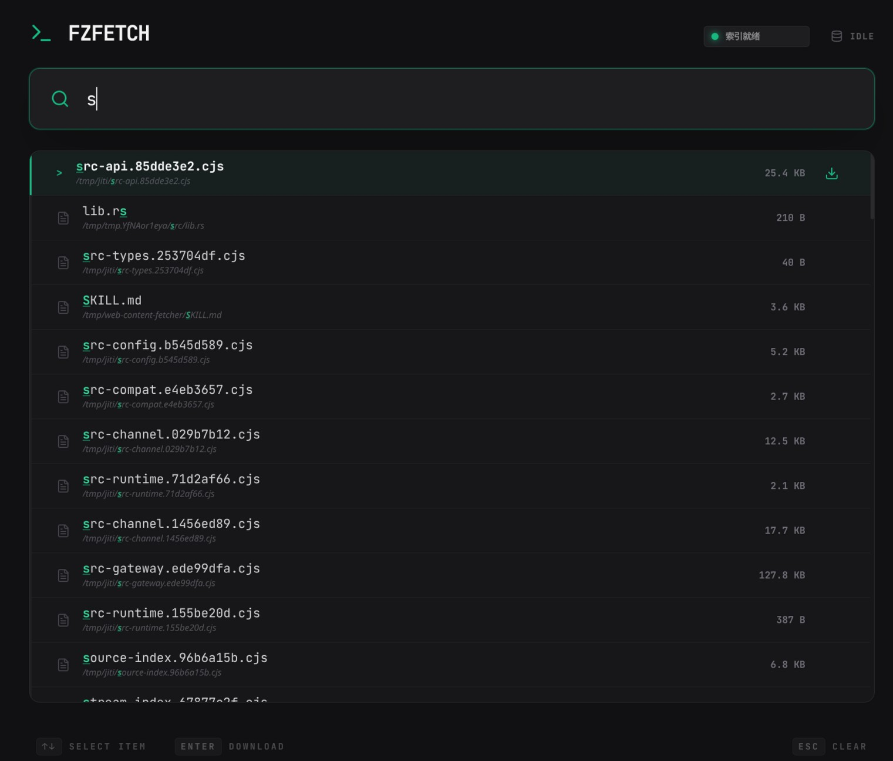

# fzfetch

[中文说明](./README_zh.md)

The web version of fzf. A high-performance fuzzy search tool for local files.

When you need to find a file, you usually do not want to wait, stand up extra services, or remember a pile of commands. `fzfetch` keeps the goal simple: start fast, search faster.

## Screenshot



## Quick Start

### Run With Docker

```bash
docker run --rm -p 3000:3000 \
  -e FZFETCH_ROOT=/files \
  -e FZFETCH_DATA_DIR=/data \
  -v "$(pwd)/files:/files" \
  -v fzfetch-data:/data \
  ghcr.io/zhpjy/fzfetch:latest
```

Or:

```bash
docker compose up -d
```

### Run Locally

Start the backend first:

```bash
cargo run
```

Then start the frontend development server:

```bash
npm --prefix frontend install
npm --prefix frontend run dev
```

By default, `fzfetch` uses:

- `./files` as the indexed root directory
- `./data` as the application data directory
- `./data/cache.txt` as the cache file

If these directories do not exist, `fzfetch` creates them automatically.

## Local Development

Common commands:

```bash
# Backend
cargo run
cargo test

# Frontend
npm --prefix frontend install
npm --prefix frontend run dev
npm --prefix frontend run build
npm --prefix frontend test
```

The backend listens on `0.0.0.0:3000` by default.

## Configuration

| Variable | Default | Description |
| --- | --- | --- |
| `FZFETCH_ROOT` | `files` | Root directory to index |
| `FZFETCH_DATA_DIR` | `data` | Application state directory that stores the cache file |
| `FZFETCH_EXCLUDE_DIRS` | empty | Comma-separated relative directory list to exclude from indexing |
| `FZFETCH_REFRESH_TTL_SECS` | `86400` | Cache expiration in seconds; the next search after expiry triggers a background refresh |
| `FZFETCH_IDLE_TTL_SECS` | `1800` | Idle lifetime in seconds before the in-memory index is unloaded |
| `FZFETCH_CLEANUP_INTERVAL_SECS` | `60` | Cleanup loop interval in seconds |
| `FZFETCH_TOP_K` | `100` | Maximum number of results returned per search |
| `FZFETCH_NUCLEO_THREADS` | `4` | Number of `nucleo` matcher threads used to bound search worker memory growth |

Notes:

- The cache file path is always `FZFETCH_DATA_DIR/cache.txt`
- The local default is `data/cache.txt`
- The container default is `/data/cache.txt`
- Every entry in `FZFETCH_EXCLUDE_DIRS` is resolved relative to `FZFETCH_ROOT`, for example `tmp,cache/private`
- Excluded directories and all of their descendants are skipped during indexing

## More Information

- [docs/backend.md](./docs/backend.md)
