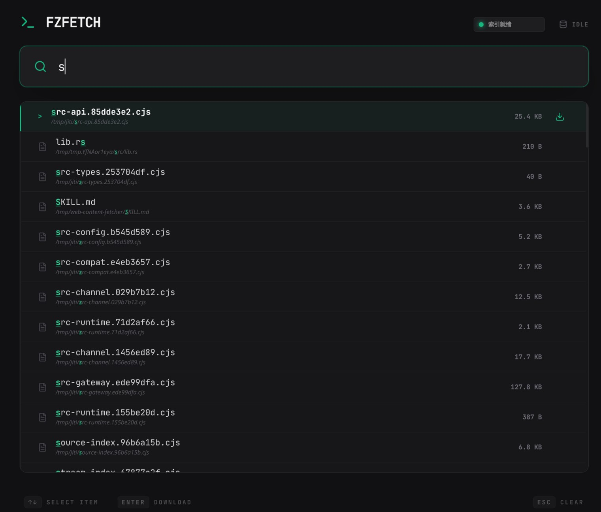

# fzfetch

[English README](./README.md)

网页版的 fzf。一个面向本地文件的高速模糊搜索工具。

想找文件的时候，不想等，不想配一堆服务，也不想记复杂命令。`fzfetch` 的目标很简单：跑起来快，搜起来更快。

## 截图



## 快速上手

### Docker 启动

```bash
docker run --rm -p 3000:3000 \
  -e FZFETCH_SEARCH_DIR=/files \
  -e FZFETCH_DATA_DIR=/data \
  -v "$(pwd)/files:/files" \
  -v fzfetch-data:/data \
  ghcr.io/zhpjy/fzfetch:latest
```

或者：

```bash
docker compose up -d
```

### 本地启动

先构建会被后端内嵌的前端资源，再编译并启动后端：

```bash
npm --prefix frontend install
npm --prefix frontend run build
cargo run
```

如果要开发前端，可以在安装依赖后另外启动 Vite 开发服务器：

```bash
npm --prefix frontend install
npm --prefix frontend run dev
```

默认会使用：

- `./files` 作为搜索目录
- `./data` 作为缓存目录
- `./data/cache.txt` 作为缓存文件

这些目录如果不存在，`fzfetch` 会自动创建。

发布版二进制会直接提供内嵌前端资源，不需要额外准备 `frontend/dist` 目录。

## 本地开发

常用命令如下：

```bash
# 后端
cargo run
cargo test

# 前端
npm --prefix frontend install
npm --prefix frontend run dev
npm --prefix frontend run build
npm --prefix frontend test
```

后端默认监听 `0.0.0.0:3000`

## 配置项

| 变量 | 默认值 | 说明 |
| --- | --- | --- |
| `FZFETCH_CONFIG` | 未设置 | 可选 TOML 配置文件路径 |
| `FZFETCH_SEARCH_DIR` | `files` | 需要建立索引的搜索目录 |
| `FZFETCH_DATA_DIR` | `data` | 应用状态目录，缓存文件位于该目录下 |
| `FZFETCH_EXCLUDE_DIRS` | 空 | 逗号分隔的相对目录列表，这些目录及其子目录不会进入索引 |
| `FZFETCH_REFRESH_TTL_SECS` | `86400` | 缓存过期秒数，过期后下一次搜索会触发后台刷新 |
| `FZFETCH_IDLE_TTL_SECS` | `1800` | 索引空闲秒数，超过后会从内存卸载 |
| `FZFETCH_CLEANUP_INTERVAL_SECS` | `60` | 后台清理循环检查周期 |
| `FZFETCH_TOP_K` | `100` | 单次搜索返回结果上限 |
| `FZFETCH_NUCLEO_THREADS` | `4` | `nucleo` 匹配线程数，用于限制搜索线程池的内存放大 |

补充说明：

- 可以从 `fzfetch.example.toml` 复制并调整出本地 `fzfetch.toml`
- 未设置 `FZFETCH_CONFIG` 时，`fzfetch` 会尝试读取 `./fzfetch.toml`，文件不存在则忽略；如果文件存在但内容无效，启动会失败
- 设置 `FZFETCH_CONFIG` 时，指定文件必须可读取且是合法 TOML，否则启动失败
- `FZFETCH_*` 环境变量会覆盖配置文件中的值
- `cache.txt` 固定为 `FZFETCH_DATA_DIR/cache.txt`
- 本地默认是 `data/cache.txt`
- 容器默认是 `/data/cache.txt`
- `FZFETCH_EXCLUDE_DIRS` 中的每一项都相对 `FZFETCH_SEARCH_DIR` 解析，例如 `tmp,cache/private`
- 被排除目录下的所有子目录和文件都会被一起跳过

## 更多信息

- [docs/backend.md](./docs/backend.md)
